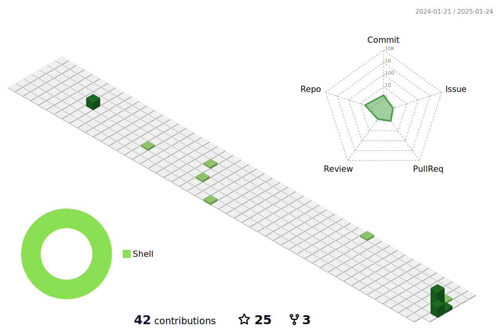

<!--   my-header-img -->

<!--   my-ticker -->  

<!--   GitHub stats graph -->
### 📈 GitHub Activity Graph:
 

<!--   green snake -->

<!--   stats + languages -->
| .                                                                                                                                       | .                                                                                                                         |
|-----------------------------------------------------------------------------------------------------------------------------------------|---------------------------------------------------------------------------------------------------------------------------|
|  |  |

</img>

<!-- dark snake -->

<!--   profile-green-animate -->

Trophy: Github Profile Trophy

 

[MIT](LICENSE)

